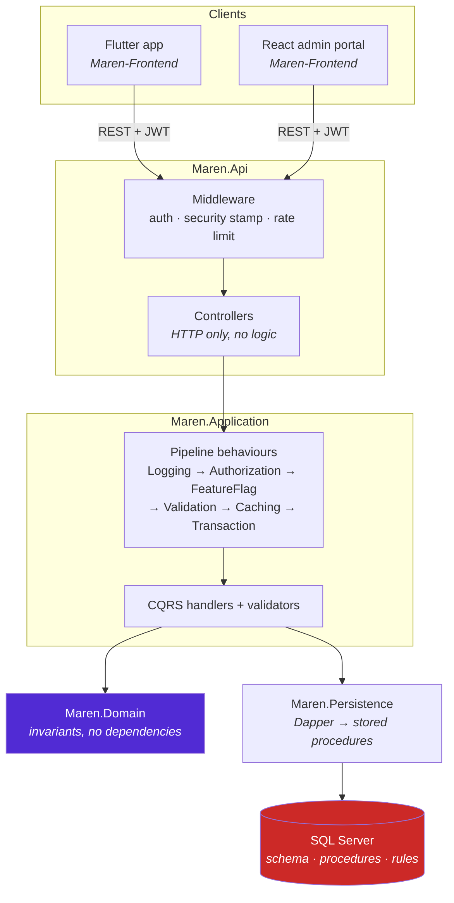
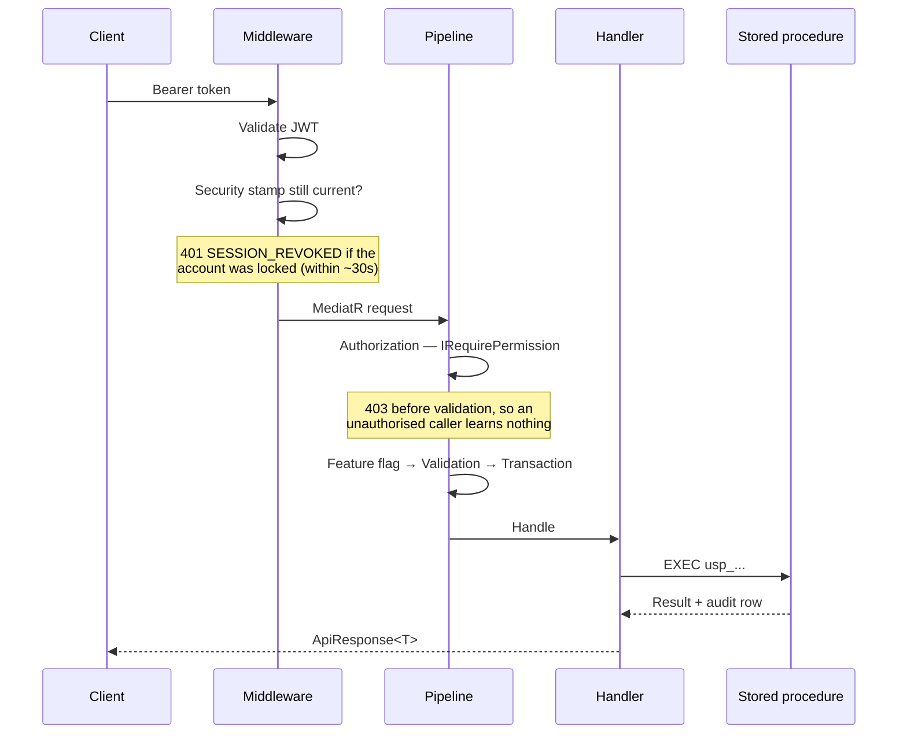

# Maren Platform — Backend

Enterprise health platform for pregnancy and maternal wellness.
ASP.NET Core 10 · SQL Server · Clean Architecture · CQRS.

[]()
[]()
[]()

**Companion repository:** [Maren-Frontend](https://github.com/ahmadsaeedpera-svg/Maren-Frontend)
— Flutter mobile app and React admin portal.

---

## Vision

Maren helps people through pregnancy: tracking symptoms, contractions, kicks and
sleep; preparing for birth; and reading guidance written and reviewed by people
who know what they are talking about.

**The platform is the product.** The mobile app is one client. An admin portal is
another. Partner and clinician surfaces will be more. Everything a client can do
is a capability the platform exposes, governed by permissions, recorded in an
audit trail and switchable by a feature flag.

The organising constraint: **content and configuration change without a Play
Store release.** Health guidance that needs a two-week app review to correct is
not safe guidance.

### Who it serves

| Audience | Surface | Status |
|---|---|---|
| Pregnant people and partners | Flutter app | Shipping, offline-only |
| Content editors and reviewers | Admin portal | Built |
| Platform administrators | Admin portal | Built |
| Support agents | Admin portal | Roles exist, screens pending |
| Clinicians | Shared summaries | Planned |

---

## Tech stack

| Component | Version | Notes |
|---|---|---|
| .NET SDK | 10.0.302 | |
| ASP.NET Core | 10.0 | Native OpenAPI + Scalar, **not** Swashbuckle |
| SQL Server | 2025 (LocalDB for dev) | Stored procedures only |
| Dapper | 2.1.66 | No ORM query generation |
| MediatR | 12.4.1 | CQRS with pipeline behaviours |
| FluentValidation | 11.11.0 | |
| Serilog | 9.0.0 | |
| xUnit | latest | 111 integration tests |

**No Entity Framework.** All data access is stored procedures called through
Dapper — see [CLAUDE.md §4.1](CLAUDE.md) for why.

---

## Getting started

### Prerequisites

- .NET SDK 10.0.302+
- SQL Server 2025 or LocalDB (ships with Visual Studio; or
  `sqlcmd` + SQL Server Express)
- `sqlcmd` with ODBC Driver 17+

### 1. Clone

```bash
git clone https://github.com/ahmadsaeedpera-svg/Maren-Backend.git
cd Maren-Backend
```

### 2. Create the database

```bash
sqlcmd -S "(localdb)\MSSQLLocalDB" -Q "CREATE DATABASE MarenPlatform"
```

### 3. Apply schema and seed

Scripts are numbered and **must run in order**. All are idempotent, so re-running
converges rather than failing.

```bash
cd src/Maren.Database

for f in 01_Schemas.sql 02_Identity.sql 03_Administration.sql 04_Health.sql \
         05_Content_Notifications_Audit.sql 06_CMS.sql 07_Access.sql \
         08_AuditContract.sql 14_Procs_Config.sql \
         10_Procs_Administration.sql 11_Procs_Identity.sql 12_Procs_Content.sql \
         13_Procs_Access.sql 15_Procs_ContentDelta.sql 16_ContentTaxonomy.sql \
         20_Seed.sql 21_Seed_CMS.sql 22_Seed_FAQ.sql \
         30_Indexes_ForeignKeys.sql 31_AI_Safety.sql \
         32_LifeStage.sql 33_Procs_Profile.sql \
         34_ContentTargeting.sql 35_Procs_ContentTargeting.sql \
         36_Timeline.sql 37_Procs_Timeline.sql \
         38_LifeDomain.sql 39_KnowledgeGraph.sql 40_Procs_Knowledge.sql \
         41_Dashboard.sql 42_Procs_Dashboard.sql \
         43_Intelligence.sql 44_Procs_Intelligence.sql \
         45_RuleEngine.sql 46_Procs_RuleEngine.sql 47_Procs_Inspector.sql \
         49_Behaviour.sql 50_Procs_Behaviour.sql 51_Procs_Inspector_Behaviour.sql \
         52_Growth_Goals.sql 53_Procs_Growth_Goals.sql \
         55_Growth_Routines.sql 56_Procs_Growth_Routines.sql 58_Recommendation.sql \
         59_Procs_Recommendation.sql 60_Procs_Inspector_Recommendation.sql 62_Coach.sql 63_Procs_Coach.sql 64_Procs_Inspector_Coach.sql 66_Prediction.sql 67_Procs_Prediction.sql 68_Procs_Inspector_Prediction.sql 69_AuditContract_Apply.sql; do
  sqlcmd -S "(localdb)\MSSQLLocalDB" -I -d MarenPlatform -i "$f" || break
done

cd ../..
```

> **`-I` is required.** It sets `QUOTED_IDENTIFIER ON`; without it the filtered
> indexes fail to create.

### 4. Verify the database

```bash
sqlcmd -S "(localdb)\MSSQLLocalDB" -I -d MarenPlatform -i src/Maren.Database/tests/cms_workflow_test.sql
sqlcmd -S "(localdb)\MSSQLLocalDB" -I -d MarenPlatform -i src/Maren.Database/tests/access_test.sql
```

Expect `TOTAL: 17  FAILED: 0` and `TOTAL: 19  FAILED: 0`.

### 5. Run

```bash
dotnet build
dotnet test tests/Maren.Tests          # 240 tests
dotnet run --project src/Maren.Api --urls http://localhost:5199
```

- API reference: http://localhost:5199/scalar/v1
- Liveness: http://localhost:5199/health/live
- Readiness: http://localhost:5199/health/ready

### 6. Create your first administrator

Register through the API, then grant the role once directly — after this, all
role management happens in the admin portal.

```bash
curl -X POST http://localhost:5199/api/v1/auth/register \
  -H "Content-Type: application/json" \
  -d '{"email":"you@example.com","password":"<a strong password>","displayName":"You"}'
```

```sql
INSERT INTO [Identity].[UserRole](UserId, RoleId)
SELECT u.UserId, r.RoleId
FROM [Identity].[User] u CROSS JOIN [Identity].[Role] r
WHERE u.Email = 'you@example.com' AND r.Name = 'SuperAdmin';
```

> This is the **only** supported SQL role grant, and only for bootstrapping the
> first account. Everything after it goes through the portal, because the
> privilege-escalation rules live in the stored procedures.

---

## Configuration

`src/Maren.Api/appsettings.Development.json` is committed and contains **local
development values only**. For any other environment supply these through
environment variables or a secret store — never a committed file.

```jsonc
{
  "ConnectionStrings": {
    // Server=<host>;Database=<db>;User Id=<user>;Password=<password>;Encrypt=True
    "MarenPlatform": "<connection string>"
  },
  "Jwt": {
    "Issuer": "maren.platform",
    "Audience": "maren.app",
    // 32+ bytes. Rotating this invalidates every access token in circulation.
    "SigningKey": "<random 32+ character secret>",
    "AccessTokenMinutes": 15,
    "RefreshTokenDays": 30
  },
  "Cors": {
    // Named origins only. Never "*" — the portal sends a bearer token.
    "AdminPortalOrigins": [ "https://admin.example.com" ]
  }
}
```

Environment variable form:

```bash
export ConnectionStrings__MarenPlatform="Server=...;Database=...;..."
export Jwt__SigningKey="..."
export Cors__AdminPortalOrigins__0="https://admin.example.com"
```

---

## Architecture



### Request lifecycle



### Why the database holds the rules

State-transition rules — publish requires approval, restore writes forward, you
cannot grant a permission you do not hold — are enforced in stored procedures,
not in C#. Anything that connects to the database bypasses the application
layer: an import job, a support script, a future service. In the database the
rules hold regardless of who connects.

Full reasoning in [`docs/ADR-001-platform-architecture.md`](docs/ADR-001-platform-architecture.md).

---

## Project layout

```
src/
  Maren.Api             Controllers, middleware, DI
  Maren.Application     CQRS, validators, pipeline behaviours
  Maren.Domain          Invariants — depends on nothing
  Maren.Contracts       DTOs shared with the frontend repo
  Maren.Persistence     Dapper repositories
  Maren.Infrastructure  JWT, hashing, caching, security stamps
  Maren.Shared          Result<T>, failure codes, permissions
  Maren.Database        Numbered SQL scripts + assertion suites
tests/
  Maren.Tests           111 integration tests against real SQL
docs/                   ADR, runbook, decisions, release blockers
```

---

## Documentation

| Document | Contents |
|---|---|
| [CLAUDE.md](CLAUDE.md) | AI assistant context, rules, and the reasoning behind each |
| [docs/ADR-001-platform-architecture.md](docs/ADR-001-platform-architecture.md) | The nine architectural decisions and their costs |
| [docs/PLATFORM_RUNBOOK.md](docs/PLATFORM_RUNBOOK.md) | Deployment, endpoint reference, release checklist |
| [docs/PLATFORM_DECISIONS.md](docs/PLATFORM_DECISIONS.md) | Open decisions awaiting an answer |
| [docs/SLICE-01-users-access.md](docs/SLICE-01-users-access.md) | Access management design and security model |
| [docs/RELEASE_BLOCKERS.md](docs/RELEASE_BLOCKERS.md) | RC items gating the mobile release |

---

## Roadmap

### Done

- **Platform foundation** — Clean Architecture, CQRS, JWT with refresh-token
  rotation and reuse detection, feature flags with deterministic bucketing,
  audit trail.
- **Enterprise CMS** — versioned content with JSON snapshots, approval workflow,
  publish as a pointer move, localisation with en-GB fallback,
  country/week/season targeting, scheduling, bulk operations, optimistic
  concurrency via ETags.
- **Users & access management** — permission-based authorization, privilege
  escalation prevention, separation of duties, session revocation within ~30s,
  audit viewer.

### Next

| Slice | Contents | Unblocks |
|---|---|---|
| **2. Notifications** | Templates, campaigns, scheduling, FCM delivery, quiet hours, per-user preferences | Four-eyes role approval; operator-initiated password reset |
| **3. Analytics** | Event ingestion, funnels, retention, cohort reporting | Data-informed roadmap |
| **4. Subscriptions** | Plans, entitlements, store receipt validation | Revenue |
| **5. Privacy** | Account deletion, GDPR export, consent ledger | **Blocked on PD-1** |
| **6. Impersonation** | Consent model, time limits, user-visible banner, separated audit | Support workflows |
| **7. Clinician** | Shared summaries, scoped access, revocable links | Clinical partnerships |

### Scalability targets

| Concern | Today | Target | Path |
|---|---|---|---|
| Cache | In-process per instance | Shared | Redis behind the existing `IQueryCache` |
| API instances | One | Horizontal | Stateless already; needs the cache change |
| Background work | None | Scheduled | Hangfire for schedules and campaign sends |
| Media | Metadata only | Blob storage | Azure Blob; schema already stores keys |
| Audit volume | Single table | Partitioned | Partition by `OccurredUtc`, archive cold ranges |

---

## Contributing

Read [CLAUDE.md](CLAUDE.md) first — it documents rules that exist because each
was violated once and caused a real defect.

Before opening a PR:

```bash
dotnet build                                    # no new warnings
dotnet test tests/Maren.Tests                   # 111/111
sqlcmd -S "$SERVER" -I -d "$DB" -i src/Maren.Database/tests/cms_workflow_test.sql
sqlcmd -S "$SERVER" -I -d "$DB" -i src/Maren.Database/tests/access_test.sql
```

Commits follow [Conventional Commits](https://www.conventionalcommits.org/).
Explain *why* in the body — the commit log here is a design record.

---

## Licence

Proprietary. All rights reserved.
