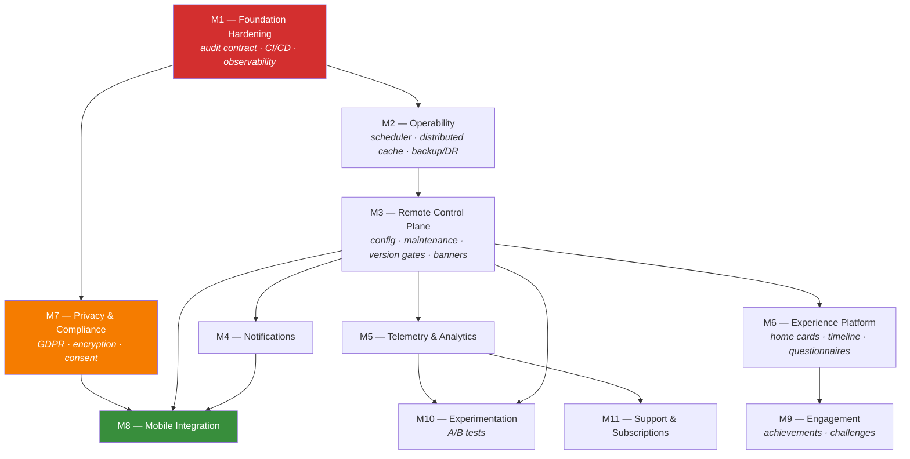

# Enterprise Platform Roadmap

**Version:** 1.0 · 2026-07-22
**Basis:** [`ENTERPRISE_AUDIT.md`](ENTERPRISE_AUDIT.md)

Ordered strictly by dependency. **No milestone begins until every dependency is
complete.** Where a later item is more visible but blocked, the blocker is
named.

Scoring: Complexity and Risk are S/M/L/XL. Security impact and Business value
are Low/Medium/High/Critical.

---

## Dependency graph

---

## M1 — Foundation Hardening

**Blocks: everything.** | Complexity **L** · Risk **M** · Security **High** ·
Value **Critical (indirect)**

Everything after this writes tables and procedures. Every month M1 waits, the
retrofit cost rises. This is the only milestone whose cost *increases* with
delay.

| # | Deliverable | Why now |
|---|---|---|
| 1.1 | Audit-column contract on all 43 tables — `CreatedBy/On`, `ModifiedBy/On`, `DeletedBy/On`, `IsDeleted`, `RowVersion` | 0/43 comply. `DeletedBy` exists nowhere. |
| 1.2 | Naming unified: `*Utc` → `*On` | Two conventions in one schema |
| 1.3 | Compliance test that **fails** on a non-conforming table | Without enforcement it regresses within a month |
| 1.4 | Soft delete everywhere; no procedure issues a hard `DELETE` on a business table | Audit rows currently reference ids that resolve to nothing |
| 1.5 | `RowVersion` on every table; concurrency helper in the repository base | 27 tables allow silent last-write-wins |
| 1.6 | Correlation ID: middleware → `ICurrentUser` → every audit row | Column exists, always null |
| 1.7 | GitHub Actions: build, test, SQL assertion suites, on every push and PR | Nothing runs tests today |
| 1.8 | Dockerfile + compose (API + SQL Server) | Deployment is `dotnet run` on a laptop |
| 1.9 | OpenTelemetry — traces, metrics, structured logs with correlation | No visibility of any kind |
| 1.10 | `.editorconfig` + analyzer rules enforced in CI | Style is convention, not rule |

**Definition of Done:** every table conforms and a test proves it; CI runs green
on push; `docker compose up` yields a working API and database; a request
produces a trace whose id appears in its audit rows.

---

## M2 — Operability

**Depends on M1.** | Complexity **M** · Risk **M** · Security **Medium** ·
Value **Critical**

| # | Deliverable | Why |
|---|---|---|
| 2.1 | Background scheduler (Hangfire) | **`usp_Content_RunDueSchedules` is never called — scheduled publishing silently does nothing today.** Live defect. |
| 2.2 | Distributed cache (Redis) behind `IQueryCache` | Three in-process caches make a second instance *incorrect*, not just slower |
| 2.3 | Distributed rate limiting | Per-instance limits multiply by instance count |
| 2.4 | Transient-fault retry (Polly) on all SQL | No retry policy exists |
| 2.5 | Backup automation + **tested** restore | No backup strategy at all |
| 2.6 | DR plan with stated RTO and RPO | No plan |
| 2.7 | HA: read replica, failover, health-probe-driven draining | Single point of failure |
| 2.8 | Environment separation: dev / staging / production config and secrets | Development config only |
| 2.9 | Azure Key Vault + managed identity | Secrets in files and environment variables |

**Definition of Done:** a scheduled publish fires; two API instances serve
consistent flags; a restore has been performed from backup and verified; RTO and
RPO are documented and measured.

---

## M3 — Remote Control Plane

**Depends on M2.** | Complexity **M** · Risk **L** · Security **Medium** ·
Value **Critical**

The first milestone that directly serves the primary goal. Everything here is
"change the app without an APK".

| # | Deliverable |
|---|---|
| 3.1 | Remote config — typed settings, environment scoping, admin write path (`Setting` has a read path only) |
| 3.2 | Maintenance mode — global and per-module, with a client-rendered message |
| 3.3 | Version gates — minimum supported, force-upgrade, soft-nag (`AppVersion` table is unreachable) |
| 3.4 | Announcement banners — targeted, scheduled, dismissible |
| 3.5 | Splash and launch assets served from platform |
| 3.6 | UI string catalogue — full translation management, not per-content only |
| 3.7 | Emergency numbers and doctor lists — country-scoped |
| 3.8 | Legal pages with a **consent ledger** — who accepted which version, when |
| 3.9 | Client bootstrap endpoint — one call returns config, flags, gates, banners, maintenance |
| 3.10 | Portal modules for all of the above |

**Definition of Done:** an operator changes config, banners, gates and
maintenance mode from the portal; a client reads all of it from one bootstrap
call; no APK involved.

---

## M4 — Notifications

**Depends on M3** (needs config and the bootstrap contract). | Complexity **L** ·
Risk **M** · Security **Medium** · Value **High**

Schema exists (`Campaign`, `Template`, `TemplateTranslation`, `Delivery`) with
**zero procedures**.

| # | Deliverable |
|---|---|
| 4.1 | Template management with localisation and variable substitution |
| 4.2 | Campaign builder — audience segments, scheduling, throttling |
| 4.3 | FCM delivery with retry, dead-lettering and receipt tracking |
| 4.4 | Per-user preferences and quiet hours honoured **server-side** |
| 4.5 | Transactional sends (password reset, approval requests) |
| 4.6 | Delivery reporting — sent, delivered, opened, failed |
| 4.7 | **Two-person approval** for any campaign over an audience threshold |

**Unblocks:** four-eyes role approval, operator-initiated password reset.

---

## M5 — Telemetry & Analytics

**Depends on M3.** | Complexity **L** · Risk **M** · Security **High** ·
Value **High**

| # | Deliverable |
|---|---|
| 5.1 | Event ingestion — batched, idempotent, schema-validated |
| 5.2 | Event catalogue managed from the portal (no APK release to add an event) |
| 5.3 | Funnels, retention, cohorts |
| 5.4 | Crash reporting wired to `CrashReport` (table exists, unreachable) |
| 5.5 | Performance telemetry from clients |
| 5.6 | Privacy-preserving aggregation — **no raw health data in analytics** |

**Security note:** this is the highest-risk milestone for privacy. A pregnancy
app's analytics stream can reveal pregnancy status by inference. Design review
required before implementation.

---

## M6 — Experience Platform

**Depends on M3.** | Complexity **XL** · Risk **M** · Security **Low** ·
Value **High**

Operator-composed app surfaces.

| # | Deliverable |
|---|---|
| 6.1 | Home cards — layout, ordering, targeting, scheduling |
| 6.2 | Journey timeline — week-by-week milestones |
| 6.3 | Questionnaire engine — definitions, branching, scoring, response storage |
| 6.4 | Checklist templates — hospital bag, birth plan, appointments |
| 6.5 | Deep-link registry with validation |
| 6.6 | Preview — render as a client would, before publishing |

Reuses the CMS approval workflow rather than inventing a second one.

---

## M7 — Privacy & Compliance

**Depends on M1. Blocks M8.** | Complexity **L** · Risk **H** ·
Security **Critical** · Value **Critical**

**Must complete before the mobile app sends any personal data to the platform.**

| # | Deliverable |
|---|---|
| 7.1 | Encryption at rest — TDE plus Always Encrypted on health columns |
| 7.2 | Key management and rotation with staged rollover |
| 7.3 | GDPR erasure — real deletion with a tombstone the audit can still reference |
| 7.4 | Data export — machine-readable, complete |
| 7.5 | Consent ledger — versioned, timestamped, revocable |
| 7.6 | Data retention policies with automated enforcement |
| 7.7 | **PD-1 resolution** — the shipped app claims no network code; Data Safety declaration and privacy policy must change before first call |
| 7.8 | Field-level permissions — an operator sees only fields their role permits |
| 7.9 | ABAC — own-records-only, country-scoped rules |
| 7.10 | MFA for administrative roles |
| 7.11 | Impersonation with consent, time limit, user-visible banner, separated audit |

---

## M8 — Mobile Integration

**Depends on M3, M4, M7.** | Complexity **L** · Risk **H** ·
Security **Critical** · Value **Critical**

The first milestone the end user sees.

| # | Deliverable |
|---|---|
| 8.1 | Platform API client in Flutter — retry, offline queue, conflict handling |
| 8.2 | Bootstrap on launch — config, flags, gates, banners, maintenance |
| 8.3 | Content sync — delta, ETag-aware, offline-first |
| 8.4 | Optional accounts with opt-in sync |
| 8.5 | Push registration and handling |
| 8.6 | Graceful degradation — the app must remain fully usable offline |

**Non-negotiable:** offline-first is not a fallback. Someone in labour with no
signal must still have their birth plan.

---

## M9 — Engagement · M10 — Experimentation · M11 — Support & Subscriptions

| Milestone | Depends on | Complexity | Value | Contents |
|---|---|---|---|---|
| **M9** | M6 | M | Medium | Achievements, badges, challenges, streak rules — all operator-defined |
| **M10** | M5, M3 | M | High | A/B tests on the orphaned `FeatureFlagVariant` schema; assignment, exposure logging, significance |
| **M11** | M5 | L | High | Support console (`SupportTicket` unreachable today); subscriptions, entitlements, receipt validation |

---

## Release milestones

| Release | Contents | Gate |
|---|---|---|
| **0.1 Internal** | M1 | CI green, containerised, traced |
| **0.2 Operable** | M2 | Restore tested, scheduler running, two instances consistent |
| **0.5 Controllable** | M3 | Operator changes app behaviour with no APK |
| **0.7 Engaging** | M4, M5 | Notifications sending, analytics flowing |
| **0.9 Compliant** | M7 | Legal sign-off on erasure, consent, encryption |
| **1.0 Connected** | M8 | Mobile reads from platform; PD-1 resolved |
| **1.5 Complete** | M6, M9, M10, M11 | Full operator control surface |

---

## Sequencing rationale

**Why M1 before anything visible.** It is the only work whose cost grows with
delay. Retrofitting audit columns across 43 tables is a contained migration;
across 150 it is a project. Everything else can be built later at the same cost.

**Why M2 before features.** Scheduled publishing is accepted by the API and
never runs. Shipping more features on an unobservable, unrecoverable,
unscalable base compounds the problem.

**Why M3 before M4–M6.** Notifications, analytics and experiences all need
config, targeting and the bootstrap contract. Building them first means building
those three twice.

**Why M7 before M8.** The moment the app sends personal data, encryption,
erasure and consent stop being roadmap items and become legal obligations. PD-1
must be answered by a person before the first call.

**Why M8 is not earlier despite being most visible.** Connecting the app before
M7 means shipping health data to a platform that cannot encrypt, erase or export
it — and contradicting a live Play Store declaration.

---

## Now executing: **M1 — Foundation Hardening**
